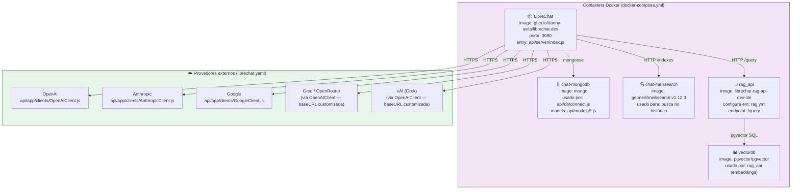
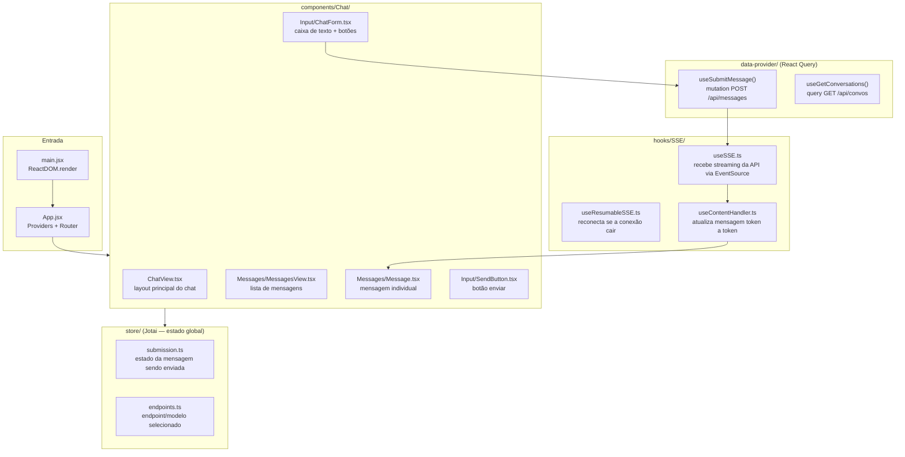
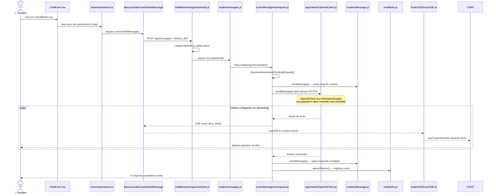

# Referência Técnica Avançada — HPE-IA (LibreChat)

> Documento com nomes de arquivos, containers e fluxo real de código.
> Pré-requisito: leia `referencia-tecnica.md` primeiro.

---

## 1. Infraestrutura (docker-compose.yml)

Todos os serviços rodam via Docker. Arquivo principal: `docker-compose.yml`.



---

## 2. Estrutura de código — Backend (api/)

```mermaid
graph TD
    subgraph ENTRY["Entrada"]
        IDX["api/server/index.js\nExpress app, porta 3080\nregistra todas as rotas"]
    end

    subgraph ROUTES["api/server/routes/"]
        RM["messages.js\nPOST /api/messages"]
        RC["convos.js\nGET/POST /api/convos"]
        RE["endpoints.js\nGET /api/endpoints"]
        RA["agents/ (pasta)\nrotas de agentes"]
        RF["files/ (pasta)\nupload de arquivos"]
        RAUTH["auth.js\nPOST /api/auth/login|register"]
    end

    subgraph MIDDLE["api/server/middleware/"]
        JWT["requireJwtAuth.js\nvalida Bearer token"]
        VAL["validateMessageReq.js\nvalida corpo da requisição"]
        LIM["concurrentLimiter.js\nlimita requests simultâneos"]
    end

    subgraph CTRL["api/server/controllers/"]
        AGR["agents/request.js\nResumableAgentController\norquestra toda a geração"]
        AGV1["agents/v1.js\ninitializeClient()"]
        EDIT["EditController.js\nregerar / editar mensagem"]
    end

    subgraph CLIENTS["api/app/clients/"]
        BASE["BaseClient.js\nclasse base — streaming, histórico"]
        OPENAI["OpenAIClient.js\nextends BaseClient"]
        ANTHRO["AnthropicClient.js\nextends BaseClient"]
        GOOGLE["GoogleClient.js\nextends BaseClient"]
    end

    subgraph MODELS["api/models/"]
        MSG["Message.js\nMongoose schema de mensagem"]
        CONV["Conversation.js\nMongoose schema de conversa"]
        TXN["Transaction.js + tx.js\ncálculo e log de tokens/custo"]
        AGENT["Agent.js\nconfig de agentes"]
    end

    IDX --> ROUTES
    ROUTES --> MIDDLE
    MIDDLE --> CTRL
    CTRL --> CLIENTS
    CLIENTS --> MODELS
```



---

## 3. Estrutura de código — Frontend (client/src/)



---

## 4. Fluxo real de código: do clique em "Enviar" até a resposta



---

## 5. Arquivos mais importantes para o dia a dia

| Área          | Arquivo                                         | Para que serve                               |
| ------------- | ----------------------------------------------- | -------------------------------------------- |
| Servidor      | `api/server/index.js`                           | Entry point Express, registra todas as rotas |
| Roteamento    | `api/server/routes/messages.js`                 | Recebe mensagens do frontend                 |
| Orquestração  | `api/server/controllers/agents/request.js`      | Controla todo o ciclo de geração             |
| Clientes IA   | `api/app/clients/OpenAIClient.js`               | Comunica com OpenAI, Groq, xAI, OpenRouter   |
| Clientes IA   | `api/app/clients/AnthropicClient.js`            | Comunica com Anthropic (Claude)              |
| Custo/tokens  | `api/models/tx.js` + `Transaction.js`           | Calcula e registra custo por requisição      |
| Agentes       | `api/server/controllers/agents/v1.js`           | Inicializa clientes de agentes               |
| Config        | `librechat.yaml`                                | Define endpoints, modelos, preços, interface |
| Chat UI       | `client/src/components/Chat/ChatView.tsx`       | Layout principal do chat                     |
| Input         | `client/src/components/Chat/Input/ChatForm.tsx` | Caixa de texto do usuário                    |
| Streaming     | `client/src/hooks/SSE/useSSE.ts`                | Recebe tokens em tempo real                  |
| Estado global | `client/src/store/submission.ts`                | Estado da submissão (Jotai)                  |
| Auth          | `api/server/middleware/requireJwtAuth.js`       | Protege todas as rotas autenticadas          |
| Docker        | `docker-compose.yml`                            | Sobe todos os containers                     |
| Banco         | `api/db/connect.js`                             | Conecta ao MongoDB                           |
| Schemas DB    | `api/models/Message.js`, `Conversation.js`      | Schemas Mongoose                             |

---

## 6. Variáveis de ambiente relevantes (.env)

```
PORT=3080                  # porta do servidor
MONGO_URI=mongodb://...    # conexão MongoDB
GROQ_API_KEY=...           # modelos open source via Groq
ANTHROPIC_API_KEY=...      # Claude
OPENAI_API_KEY=...         # GPT-4o, o3
GOOGLE_KEY=...             # Gemini
XAI_API_KEY=...            # Grok
JWT_SECRET=...             # assina tokens de autenticação
```

---

_Atualizado em 2026-03-23 — gerado com base nos arquivos reais do repositório._
