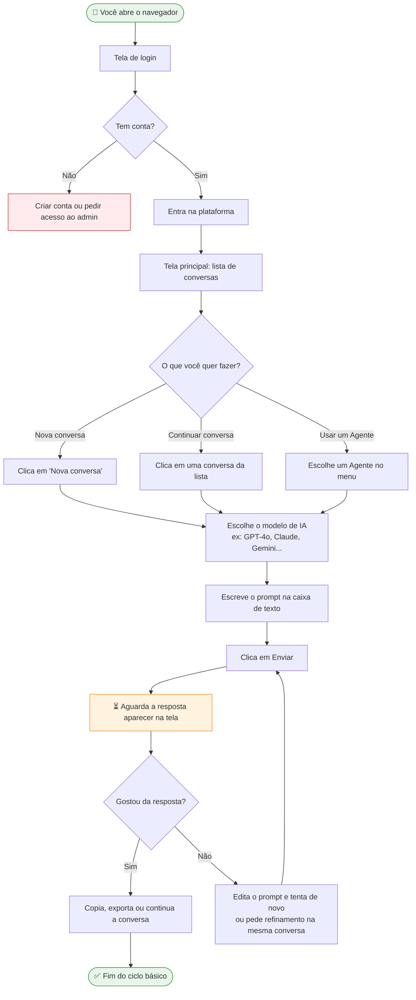
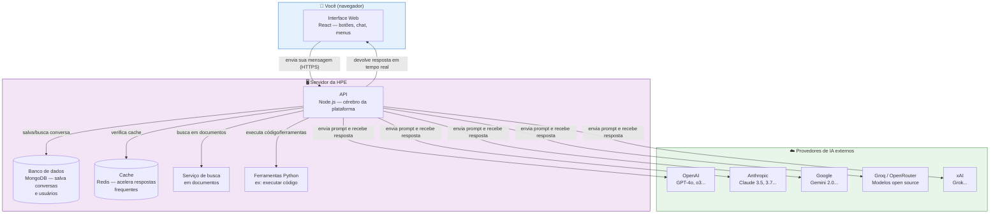
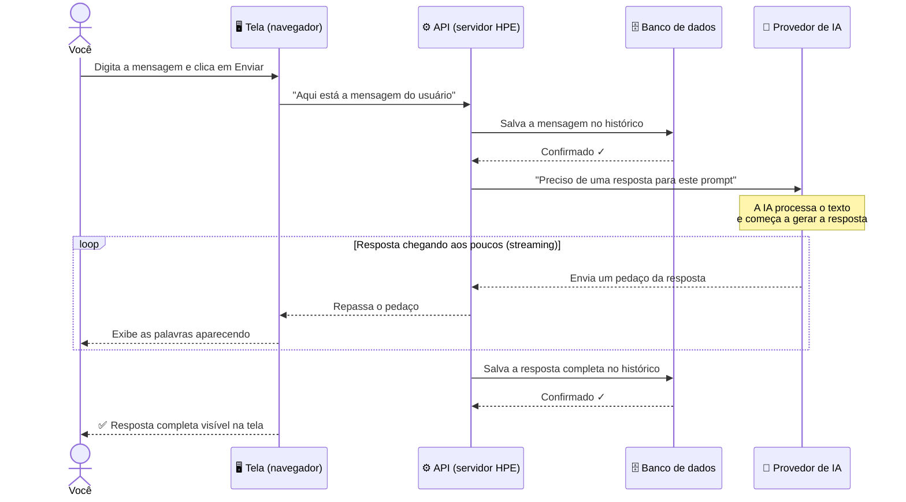

# Referência Técnica — Plataforma HPE-IA (LibreChat)

> Leia na ordem: primeiro o fluxo de uso, depois a arquitetura, depois o ciclo de uma mensagem.

---

## 1. O que você faz na tela (Fluxo de uso)

---

## 2. Como a plataforma é montada (Arquitetura)

> Pense neste diagrama como um mapa dos sistemas que existem. Você usa o **Navegador**, o resto acontece nos bastidores.

---

## 3. O que acontece quando você clica em "Enviar" (Ciclo de uma mensagem)

> Este diagrama mostra o caminho completo da sua mensagem, do clique até a resposta aparecer na tela, em ordem cronológica.

---

## Resumo rápido

| O que você vê                      | O que é por baixo                        |
| ---------------------------------- | ---------------------------------------- |
| Tela de chat                       | Frontend em React (JavaScript)           |
| Botão "Enviar"                     | Chama a API do servidor                  |
| Histórico de conversas             | Banco de dados MongoDB                   |
| Resposta aparecendo aos poucos     | Streaming via API → servidor → tela      |
| Seletor de modelo (GPT, Claude...) | Servidor conecta com provedores externos |
| Agentes e ferramentas              | Módulos extras no servidor + Python      |

---

_Atualizado em 2026-03-23 — Para dúvidas, fale com a equipe de IA da HPE._
